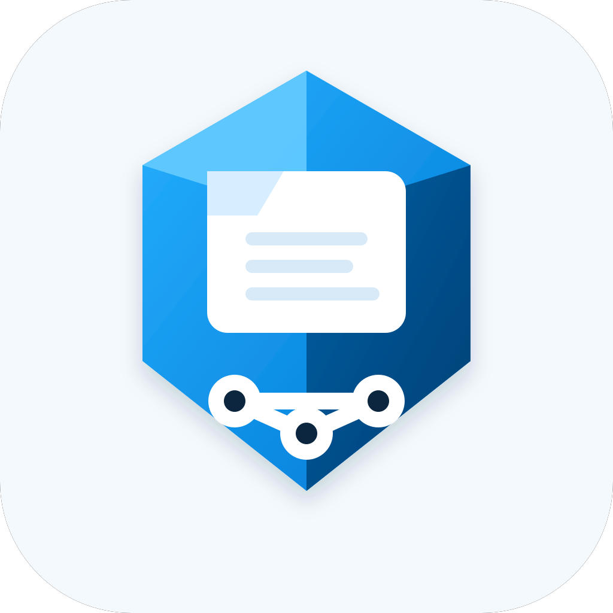

# AzureMcp

Small personal MCP server for the parts of Azure DevOps that are actually useful in day-to-day work.

This is intentionally not a full Azure or Azure DevOps surface area wrapper.
The goal is a small, composable toolbelt with a familiar architecture:

- `AzureMcp.Host` for MCP hosting and startup/config parsing
- `AzureMcp.Tools` for tool implementations and Azure DevOps integration
- `AzureMcp.Tools.Tests` for fast unit tests around parsing, options, and tool behavior

## First tools

The current tools are `read_work_item` and `get_context`.

`read_work_item` accepts a work item id and returns a structured object with the fields that matter first:

- id
- title
- description (plain text + raw html when present)
- assigned person
- state
- work item type
- url
- parent work item id (when present)
- child work item ids
- related work item ids

That gives us a real end-to-end slice to shape the architecture before adding more tools.

`get_context` accepts any work item id inside a parent/child hierarchy, walks upward to the topmost parent, then returns the vertical context in stable order from parent to children.

## Configuration

AzureMcp requires a config file path on startup.
The **config file is the source of truth** for the Azure DevOps connection.

If required values are missing when you call a tool, the server returns an actionable error:
ask the user for the missing value(s), then update the config file.

### Required

- `--config <path>` (required)

### Config file shape

```json
{
  "organizationUrl": "https://dev.azure.com/your-org",
  "personalAccessToken": "your-pat",
  "project": "optional-project"
}
```

## Run locally

```bash
export PATH="$PATH:/home/bob/.dotnet"
dotnet run -c Release --project src/AzureMcp.Host/AzureMcp.Host.csproj -- --config ~/.config/azuremcp/config.json
```

## Tool: `read_work_item`

Input:

```json
{
  "workItemId": 12345
}
```

## Tool: `get_context`

Input:

```json
{
  "workItemId": 12345
}
```

Example response shape:

```json
{
  "tickets": [
    {
      "id": 100,
      "title": "Parent feature",
      "workItemType": "Feature",
      "descriptionText": "High-level context"
    },
    {
      "id": 12345,
      "title": "Bug in child item",
      "workItemType": "Bug",
      "descriptionText": "Concrete problem"
    }
  ]
}
```

Example response shape:

```json
{
  "ticket": {
    "id": 12345,
    "title": "Improve deployment diagnostics",
    "state": "Active",
    "workItemType": "User Story",
    "descriptionText": "Investigate missing logs during deployment.",
    "assignedTo": {
      "displayName": "Ada Lovelace",
      "uniqueName": "ada@example.com"
    },
    "parentWorkItemId": 100,
    "url": "https://dev.azure.com/your-org/_apis/wit/workItems/12345"
  },
  "error": null
}
```

## Next likely tools

Once this slice feels right, obvious next candidates are:

- read multiple work items
- search work items by query
- list pull requests
- read pull request
- list pipeline runs / get build status

But only if they earn their place.
